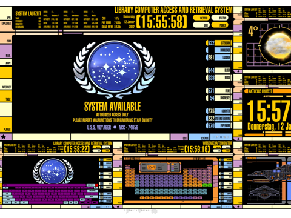
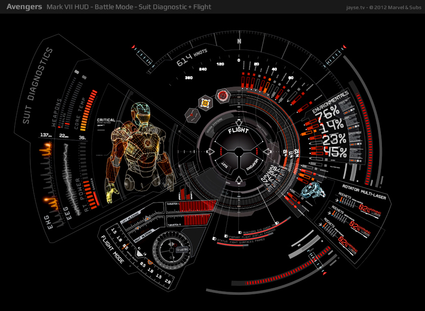
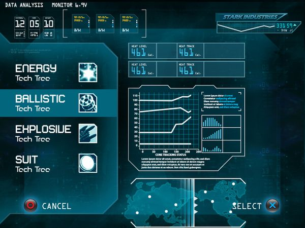

# Object Oriented Programming Assignments

## Assignment 2 - Due 31 January 2017

Last year this assignment was worth 20%

For this assignment I want you use everything you have learned in the class so far to create a classic game using Processing. You can make any game you like. Games Fleadh/Imagine Cup projects are all encouraged or indeed any other competitions. The theme for Games Fleadh this year is "Racing game".

Some ideas:

Space Invaders
Asteroids
Breakout
Spacewar
Tower defense
Marking Scheme:

Please include a readme file and a YouTube video demo of your assignment

Complexity: 25% Visuals:25% Jazz: 20% Use of git: 20% Documentation: 10%

| Grade | Description |
| ------|-------------|
| First | A project that looks great. All the art is 100% procedural or self drawn and looks beautiful. There a significant amount of clever animation or gameplay. For example multiple "modes" or "screens". The assignment has lots of functionality. There is depth to the assignment. For example, progression and powerups. The code is organised into classes that use inheritance, polymorphism, abstract classes and interfaces appropriately. You will be made significant changes to the example we built in the class. You have demonstrated independent learning. There is a lot of novelty and originality. All the code is written by the you. You will have used PVectors, transforms and classes to create autonomous elements in the assignment. You will loading content from text files. You will have used git extensively. Everything works. > 60 git commits|
| 2.1 | The project looks good. There is a some animation or gameplay. You put in a good effort. Some features may not be complete or entirely working. Probably no file IO, but there should be while loops, for loops if statements etc to control aspects of the assignment. You have used classes, but possibly not inheritance and polymorphism. Your project might reuse a lot of the examples we made in the class. 40-60 git commits |
| 2.2 | The project looks so so, but is pretty basic. There should be some animation or gameplay but significant issues that you couldn't resolve. You may have used sprites instead of drawing everything. All the movement and animation code will be pretty basic for example colours changing each frame or movement controlled by variables that just update each frame. Little or no control code. There is not much code, maybe a page or two. Between 10 and 20 checkins |
| Pass | All code in one file. Around a hundred lines of code. Looks like it could have been completed in an hour or two. Mostly drawing code, little or no controling code. Little or no functionality. Lots of code acquired from other sources. < 10 checkins |
| Fail | Something very basic that looks like it could have been completed in an hour. Just drawing code, no control code. The assignment has no interactivity. Significant unaddressed technical problems. No git usage.  |

Rules!

- As much as possible this project should be 100% your own code. You will not get any marks for any code that include that you get from books or from the internet. This assignment is about testing what *you* have learned and what *you* can do.
- Any suspected plagorism will be dealt with according to DIT General Assessment Regulations. This could mean expulsion from DIT. I will personally grade all assignments.
- There will be a feedback session after the assignment where you will have the opportunity to get individual feedback on your submissiona and have your mark explained to you.
- The date for submission is before the lab, the week of 1 Feb 2016. 
- All assignment submissions must be demoed in the lab that week.
- If you need to submit an assignment late, you must submit a PC/1 form to the exams office.

## Assignment 1 - Due 29 November 2016

Use Processing to create a UI for a sci-fi movie device like a warp drive, engines, weapons system. You can base it on any movie you like or come up with your own. It should be kinda usable. It should have lots of animation & interactivity and look amazing. It can be as far out as you like. In other words it can be for an alien. You sould use all the stuff you are learning on the course:

- Variables, loops, methods
- Arrays & array lists
- Objects, inheritance, polymorphism
- The unit circle and trigonometry
- pushMatrix, popMatrix, translate and rotate

You can take inspiration from sci-fi movies that you like, such as these ones:

Also! You should include a readme.md file and embed a youtube video demo of your assignment in the readme file.

Marking Scheme:

Complexity: 25% UI:25% Jazz: 20% Use of git: 20% Documentation: 10%

| Grade | Description |
| ------|-------------|
| First | A project that looks impressive. All the graphics are 100% procedural and look beautiful. There a significant amount of clever animation or interactivity. You will have made classes for UI elements such as buttons. You may also have used polymorphism, abstract classes and interfaces where appropriate. You will have used PVectors, transforms and classes to create autonomous elements in the assignment. There is a lot of novelty and originality and the UI you made looks like it could be used in a movie. You will be loading content from text files. You will have used advanced features of Processing that we didn't cover in the class. You will have used git extensively. Everything works. > 50 git checkins|
| 2.1 | The project looks good. There is a some animation and interactivity, but not too complicated. You put in a good effort. Some features may not be complete or entirely working. Probably no file IO, but there should be while loops, for loops if statements etc to control aspects of the assignment. You have used classes, but possibly not inheritance and polymorphism. 20-40 git checkins |
| 2.2 | The project looks so so, but is pretty basic. There should be some animation but significant issues that you couldn't resolve. You may have used sprites instead of drawing everything. All the movement and animation code will be pretty basic for example colours changing each frame or movement controlled by variables that just update each frame. Little or no control code. There is not much code, maybe a page or two. Mostly based on the example code. Between 10 and 20 checkins |
| Pass | All code in one file. Around a hundred lines of code. Looks like it could have been completed in an hour or two. Mostly drawing code, little or no controling code. Little or no functionality. Lots of code acquired from other sources. < 10 checkins |
| Fail | Something very basic that looks like it could have been completed in an hour. Just drawing code, no control code. The assignment has no interactivity. Significant unaddressed technical problems. No git usage.  |

Rules!

- As much as possible this project should be 100% your own code. You will not get any marks for any code that include that you get from books or from the internet. This assignment is about testing what *you* have learned and what *you* can do.
- There will be a feedback session after the assignment where you will have the opportunity to get individual feedback on your submissiona and have your mark explained to you.
- All assignment submissions must be demoed in the lab that week.
- If you need to submit an assignment late, you must submit a PC/1 form to the exams office.
